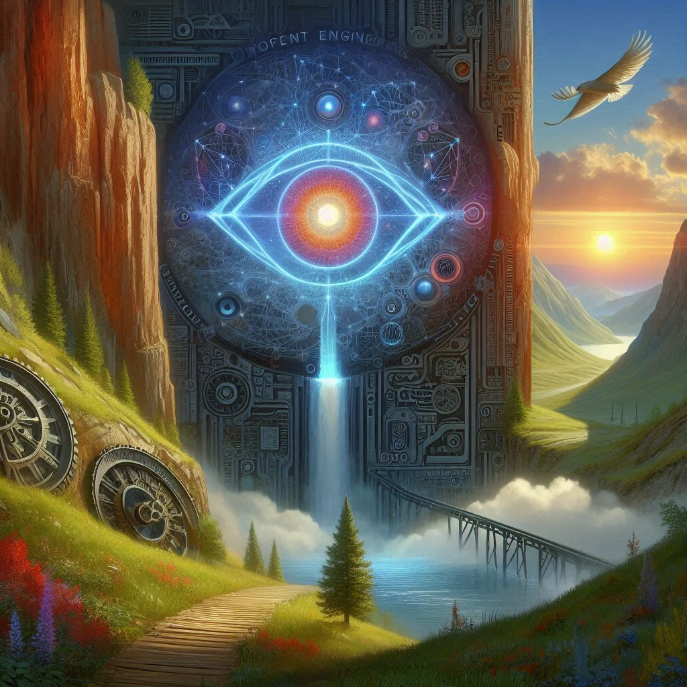
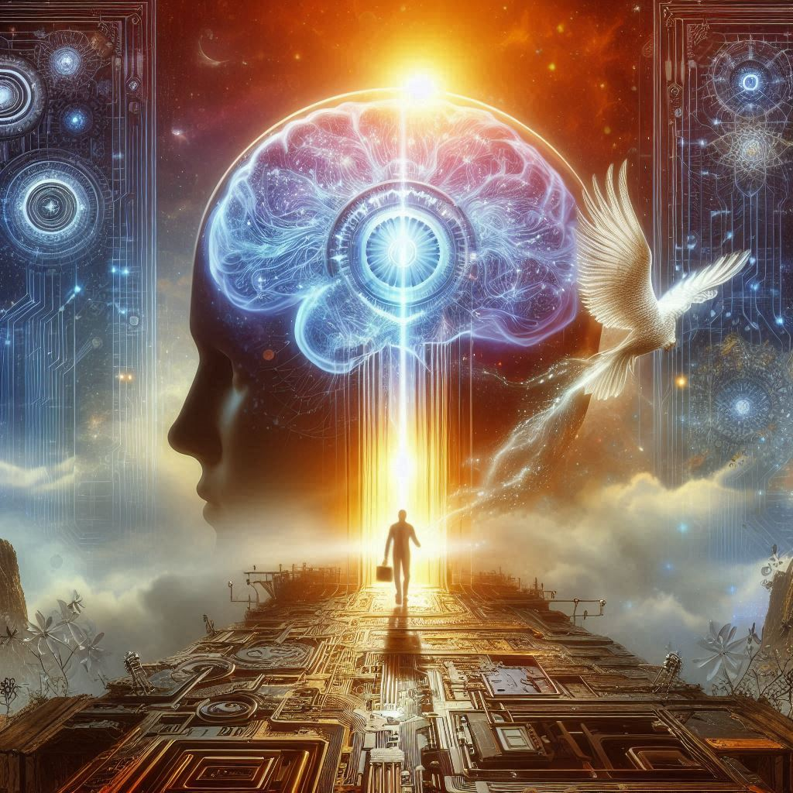

    preview do podcast

    <audio src="output/audio.mp3" controls title="Podcast editado"></audio>

# Link do Spotfy
<h1>Introdução à Arte dos Prompts: Desvendando os Segredos da IA</h1>

[Introdução à Arte dos Prompts: Desvendando os Segredos da IA](https://open.spotify.com/show/5rBHaApRXbpApmP71rHODJ)

No episódio de estreia de "A Arte do Conhecimento: Desvendando a IA e os Prompts," Alana Daniele nos guia pelo fascinante mundo da inteligência artificial. Descubra como a IA aprende a reconhecer padrões e explore a arte dos prompts com a ferramenta inovadora ChatGPT. Ideal para iniciantes, este episódio revela como você pode interagir com a tecnologia de forma mais eficaz e inteligente. Prepare-se para desvendar os segredos da IA e transformar sua forma de entender e usar essa poderosa ferramenta!

# Projeto Podcast Gerado por I.A.s

 > ℹ️ **NOTE:** Este é o repositório desenvolvido durante o Boot Camp Santander 2024 - Fundamentos de IA para Devs em parceria com a [DIO](https://dio.me)

Projeto com o objetivo de gerar um podcast utilizando ferramentas de IA através de prompts mais trabalhado.

Utilizer uma esteira de prompts para gerar cada etapa do processo criativo.

## 💻 Tecnologias utilizadas no projeto

- [ChatGPT](https://chat.openai.com/) 
- [Microsoft Designer](https://designer.microsoft.com/)
- [ElevenLabs](https://beta.elevenlabs.io/) **Sarah**

## ✨ Como foi feito ?

- Roteiro gerado via ChatGPT
- Audio gerado pela ElevenLabs
- Imagem gerada por Microsoft Designer

## 📚 Materiais

- [Notion Template](https://helpful-jump-17b.notion.site/PAS-Podcast-AI-Studio-210489e15d7a4a73b743bb159e45d06f?pvs=4)
- [Editor de aúdio](https://www.capcut.com/editor?from_page=landing_page&__action_from=picture_V%C3%ADdeos%20profissionais%20em%20minutos,%20n%C3%A3o%20em%20horas.)

## 🛠️ Instruções de execução

Utilize os prompts dentro do link do `Notion` fornecido na parte de `Materiais` para criar um podcast de maneira automatizada, para isso siga o passo a passo abaixo.

- 🤖 1. Use os prompts de roteiro no `chagpt`
- 🤖 2. Use os prompts de roteiro gerados pelo chatgpt no  `ElevenLabs`
- 🤖 3. Use os prompts de artes no `microsoft designer`

## 👨‍💻 Expert

    
    
&nbsp&nbsp&nbspAlana Daniele 
    &nbsp&nbsp&nbsp
    <a 
        href="https://github.com/a-natureza">
        GitHub
    </a>
    &nbsp;|&nbsp;
    <a 
        href="https://www.linkedin.com/in/alana-daniele/">
        LinkedIn
    </a>
    &nbsp;|&nbsp;
    <a 
        href="https://www.instagram.com/tendanapraia">
        Instagram
    </a>
    &nbsp;|&nbsp;

  

---

⌨️ com 💜 por [Alana Daniele](https://github.com/a-natureza)